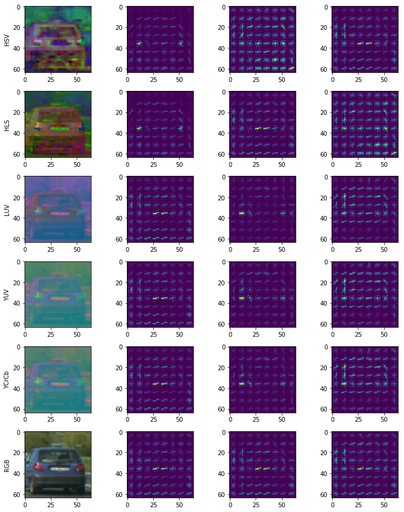

**Vehicle Detection Project**

The goals / steps of this project are the following:

* Perform a Histogram of Oriented Gradients (HOG) feature extraction on a labeled training set of images and train a classifier Linear SVM classifier
* Optionally, you can also apply a color transform and append binned color features, as well as histograms of color, to your HOG feature vector. 
* Note: for those first two steps don't forget to normalize your features and randomize a selection for training and testing.
* Implement a sliding-window technique and use your trained classifier to search for vehicles in images.
* Run your pipeline on a video stream (start with the test_video.mp4 and later implement on full project_video.mp4) and create a heat map of recurring detections frame by frame to reject outliers and follow detected vehicles.
* Estimate a bounding box for vehicles detected.

---
# Data processing

Code is available in [Train.ipynb](Train.ipynb).

## Data sources

I start with the course-provided `vehicles` and `non-vehicles` data of 64x64 car and non-car images. The vehicle data is from [KITTI Benchmark Suite]('http://www.cvlibs.net/data_sets/kitti/') and [GTI Vehicle Image DB](http://www.gti.ssr.upm.es/data/Vehicle_database.html).

Since the GTI vehicle images contain images that are captured in rapid succession, there are a lot of images that look identical. I manually separate the GTI data set in order to have a good training and test set. For the KITTI and non-car data sets, I use `train_test_split` from `sklearn` to split 80% of the images for training and 20% for testing the accuracy of the classifier.

I also used a small subset of the [Udacity Self Driving Car Data set](https://github.com/udacity/self-driving-car/tree/master/annotations).

Here are examples of what the data sets contain for the `car` and `not-car` classes:


In using my classifier on the stretch of road in the project video, I noticed that there were a lot of false positives. One of the ways I reduced false positives was to augment the non-car data set with examples where the classifier was producing false positives from the same stretch of road.

The code to slice negative examples from the project video is available at the bottom of [Train.ipynb](Train.ipynb).

# Extracting Features

## Color Histograms

Code available in [Train.ipynb](Train.ipynb).

I start with using color histograms to train a classifier to distinguish between car vs not-car. I plotted the histograms for many examples across many color spaces to visually inspect color spaces that might yield better results.

Here's an example of color histograms of a car across many color spaces:


And here's color histograms of a not-car image:


Here I can see a noticeable difference in the histograms between car and not-car. But what if the car is gray instead of black? What if there was a section of the road that had a similar amount of yellow as a car?

In terms of color space, I chose the BGR / RGB histogram because I found through trial and error that when using all channels, the difference in accuracy of the classifier across color spaces was minimal.

The color histograms alone don't give a great deal of accuracy because many not-car images have identical color distributions to car images. I need to be able to distinguish between the outlines or shapes of a car vs not-car. 

## Histogram of Oriented Gradients (HOG)

Code available in [Train.ipynb](Train.ipynb).

HOG breaks the image up into many blocks of pixels and for each block, it returns the dominate gradient direction and magnitude. Combine all the blocks together and a unique outline can be seen for different objects.

I used `sklearn.hog()` to visualize the effects of changing the number of cells per block, the pixels per cell, the number of  gradient directions (similar to histogram bins) and the color space used.

Here's what I start with:

`orientations=9, pixels_per_cell=(8, 8), cells_per_block=(2, 2), colorspace='all'`

Car:



Not Car:


## Selecting the final set of parameters

Here's what I use to train the classifier:

`orientations=11, pixels_per_cell=(16, 16), cells_per_block=(2, 2), colorspace='YUV', histogram_bins=32`

I find the `YUV` and `YCrCb` retains the shape the car the best visually and unlike `RGB` didn't have the same HOG pattern across all channels. This adds more unique features for the classifier to distinguish between car / not-car.

I use 16 pixels per cell after running my classifier through many sub-windows of a test image and finding that it took a very long time to calculate the hog features. So I bump the `pixels_per_cell` to 16 in order the reduce the time it took to calculate the HOG features while maintaining similar accuracies. To help the classifier gain accuracy while reducing the number of HOG features, I increase the granularity of the bins for the gradient orientations from 9 to 11. I tried 9, 18, 15, 13, then settled on 11.

I left the `cell_per_block` as 2 because increasing it to 4 reduced the accuracy of the classifier.

Here is an example of the car image above with the new HOG parameters:


## Features excluded

I tried adding a feature vector made by reducing the sample image of 64x64 to 32x32 and seeing how the spatial arrangement of the color values can contribute to identifying a car. Unfortunately, this made the prediction step a lot slower due to the increased feature vector length and resulted in more false positives of cars. It did not help increase the true positives. So I do not use spatial color features in my classifier.


## Optimizing feature extraction time

I use OpenCV's `HOGDescriptor` function instead of `sklearn.hog()` in the actual car detection pipeline because of its speed. The code is available at [car_finder.py](car_finder.py)

# Training the classifier

Code available in [Train.ipynb](Train.ipynb).

I use `sklearn.model_selection.GridSearchCV` in order to find parameters for the Support Vector Machine that would be my classifier.

My parameters for GridSearchCV are: `{'kernel':['linear', 'rbf'], 'C':[1, 5, 10, 20, 50, 100]}`. The GridSearchCV will cycle through the parameter combinations: `SVC(C=1, kernel='linear')`, `SVC(C=1, kernel='rbf')`, `SVC(C=5, kernel='linear')`, etc and return the classifier with the best accuracy.

By using GridSearchCV, I find that my best performing classifier uses the RBF kernel and C=5.

In training my classifier, I use the `probability=True` parameter to get a classifier that can product probabilities of each class. I use this later to tune the pipeline to eliminate false positives.

After training, I save the classifier and feature extraction parameters using `pickle` so I can easily use them later.

# Finding cars

Code available in [CarFinder.ipynb](CarFinder.ipynb).

## Sliding window search

In order to find cars in the image, I slide a window across the regions of the road that cars appear in. For each window I take a cropping of the larger image,  resize cropped image to match the input size for the classifier, extract the features, and feed it through the classifier.

Since cars on the road can be different sizes depending on how far they are away and the type of car, I use 4 different window sizes with different overlap percentages. A large overlap can lead to the pipeline being very slow and a overlap too small can miss cars.

Here are my window sizes, overlap, and areas which they scan:
```python
small = slide_window(img, x_start_stop=[650, img.shape[1]],  y_start_stop=[390, 490], xy_window=(96, 96), xy_overlap=(0.8, 0.7))

md = slide_window(img, x_start_stop=[700, img.shape[1]], y_start_stop=[400, 620], xy_window=(128, 128), xy_overlap=(0.75, 0))

lg = slide_window(img, x_start_stop=[900, img.shape[1]], y_start_stop=[400, 650], xy_window=(144, 144), xy_overlap=(0.8, 0))

xl = slide_window(img, x_start_stop=[1000, img.shape[1]], y_start_stop=[400, 650], xy_window=(192, 192), xy_overlap=(0.8, 0))
```

Let's take the case of the small window:

x_start_stop: this is the range of x values to search for cars in. Since our test videos always have cars on the right side, I limited the search to the right half of the image. This is obviously not practical for real-world use where cars can be on either side of the road. This was done to optimize for speed of the pipeline.

y_start_stop: Since there are no cars in the sky (yet) I searched for cars in the bottom half of the image. Taking into account that objects further away are smaller, I limited the search of the small windows to a narrow region further up the road. 

xy_window: This is the window size.

xy_overlap: The overlap of windows as we stride across the larger image. a 0.75 horizontal overlap on a 96x96 image means I'm moving 24 pixels each time in the x-direction.

The code for creating the sliding window positions can be found in [car_finder.py](car_finder.py).

After cropping the image down to a list of small windows, I resize them and extract the same features as I did when training our classifier.

The code for `search_windows` can be found in [car_finder.py](car_finder.py).

After extracting the feature, I feed it into the classifier and extract the probabilities for each class using the `clf.predict_proba` function. If the probability of a car is more than 0.8, then I consider that window to have a car. I chose 0.8 after trial and error to balance the need to eliminate false positives while maintaining enough true positives.

After find the windows that have cars (hot windows), I calculated a heatmap based on how many hot windows overlap each other. This heat map gives the me confidence in areas with cars and lets me filter out the areas without cars.

From the heatmap, I use the `label` function from `scipy.ndimage.measurements` in order to identify the individual blobs. I assume each blob is a vehicle (because we're only classifying vehicle vs not), apply a threshold for the heatmap and find the bounding boxes for each car.

The code for applying the heatmap and finding boxes is defined in [car_finder.py](car_finder.py) and implemented in the VehicleTracker class inside [CarFinder.ipynb](CarFinder.ipynb).

Here are some examples of the hot windows (left) that the classifier has detected a car in, the heatmap (middle) and bounding box for each car (right).

Two cars with very strong confidence:


One car, maybe.


One car, good confidence.


Two cars with good confidence.


Two cars with very strong confidence.


The high overlap of the small windows might be overkill in some frames but in others, it is barely enough to detect one car in the distance.

# Results

Here's a [link to my video result](output_images/project_video_combined_fast.mp4)

---

# Smoothing out detections

Code is available in [CarFinder.ipynb](CarFinder.ipynb) under the `VehicleTracker` class.

To smooth out the jitter, false positives and discrepancies between frames, I use the following techniques:

1. Track each vehicle as its own entity with properties for:
    * The centroid of its bounding box so I can track its movement over time
    * The last bounding box
    * If it was present, then missing, the duration of the lapse
    * Its box ratio

    I assume the cars do not rapidly appear and disappear on the road, so the bounding boxes for cars should not either. Using this assumption, I smooth out the changes in the bounding box of the cars by:
    * If I get a bounding box that is not close to any existing detected cars on the road, it must be a new car. So make a new vehicle object to track it.
    * If bounding box is close to an existing vehicle, average the bounding box sizes for that vehicle over the past 20 frames (~1s).

2. Averaging the heatmaps over the last 8 frames and only setting a bounding box around regions that pass some threshold.

3. Filter out bounding boxes that have weird shapes (too narrow or too wide). If the bounding box has a very wide width, it's most likely two cars with heatmaps that are lumped together. Split this heatmap evenly into two cars. If the ratio of the bounding box is too skinny or too wide, it's likely not a car so don't update the vehicle box.

In tuning my pipeline, I output the raw bounding box from the original heatmaps and the vehicle bounding box after going through the smoothing steps.

# Improvements

## Vehicle Classification

The first major improvement I'd like to make is the speed of vehicle classification. Currently, it takes ~0.2s to process all the sliding downs on one frame of video. This is primarily because I have a high overlap of search windows, somewhat because I use the RBF kernel.

If I use a linear kernel on the Support Vector Machine classifier, I can reduce the detection time to about half of the RBF classifier; however, I found the linear kernel one I trained had too many false positives. 

To improve my linear classifier, I can feed it more non-car data. Which I did to some degree by extracting non-car frames from the project video. I also only used a subset of Udacity's annotated cars dataset because the training time to use the full dataset was too long on my computer, I can train the classifier on a wider variety of cars for its detection to be more robust.

My classifier and window search method is not generalizable across other stretches of roads without a few modifications:
1. It needs to search the whole road, not just the right portion
2. It needs to consider trucks / other vehicle sizes
3. It needs more data on vehicles traveling in the opposite direction.

For the classifier to be robust, it should handle how cars look under different lighting conditions, not just bright sunlight on a clear highway.

## Tracking

There are many instances where the bounding boxes don't entire cover the entire car:


And instances where the box lingers on the old detected shape (I set it to linger for about 1.5s just in case there is a temporary lapse in detection)


To improve my vehicle tracker:
* I can use the position, size, and movement of the car to estimate where it will end up. This will help me save on doing the sliding window across the entire image for every frame. This improvement helped the lane finder speed tremendously.
* I can track the movement of the cars overtime to predict the car will be in case the classifier can't find a car.


# Adding in lane detection
 
My video will also have lane detection from a previous project. You can find the code for this in [lane_finder.py](lane_finder.py).